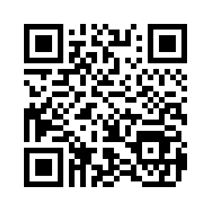

## Dashboards

* Uniswap V3 Pools [Screener](https://dune.com/coindataschool/uniswap-v3-pools-volume-fees-tvl-and-fee-apr)
* Curated Uniswap V3 Pools: [Volume, Fees, TVL, and fee APR](https://dune.com/coindataschool/curated-uniswap-v3-pools-volume-fees-tvl-and-fee-apr)
* Predict ROI and Fee APR of UniV3 [WBTC-WETH positions on Ethereum](https://coindataschool-univ3-roi-prediction-wbtc-weth-main-oufzxi.streamlit.app/) and [WETH-GMX positions on Arbitrum](https://coindataschool-univ3-roi-prediction-weth-gmx-main-ponc95.streamlit.app/) with machine learning.
* [GLP](https://dune.com/coindataschool/glp-arbitrum) and [GMX](https://dune.com/coindataschool/gmx-arbitrum) Key Metrics on Arbitrum.
* [GLP](https://dune.com/coindataschool/glp-avalanche) and [GMX](https://dune.com/coindataschool/gmx-avalanche) Key Metrics on Avalanche.
* Transaction Cost on [GMX, Arbitrum](https://dune.com/coindataschool/cost-of-transactions-on-gmx-arbitrum) and [GMX, Avalanche](https://dune.com/coindataschool/cost-of-transactions-on-gmx-avalanche).
* [Backtest and Comparison of GLP Strategies](https://coindataschool-glp-strats-comp-dashboard-main-vimp75.streamlitapp.com/).
* [Beta and Excess Return of GLP & TriCrypto](https://coindataschool-beta-sharpe-ret-dashboard-main-5rm56h.streamlitapp.com/).
* [Hayes USD Liquidity Conditions Index](https://coindataschool-husdlci-main-pfjljd.streamlit.app/).
* [Efficient Frontier & Min-Variance Portfolio of GMX+GNS](https://coindataschool-minvar-portfolio-dashbord-main-w2wjqa.streamlit.app/).
* [XMON Trading Data by Behavior](https://dune.com/coindataschool/xmon-sudoswap).

## Python Packages

* [defillama2](https://github.com/coindataschool/defillama2), a python client for DeFiLlama's data API.
* [quickplot](https://github.com/coindataschool/quickplot), easy and quick generation of common statistical charts in a declarative fashion, based off of matplotlib and seaborn.

## Donate

Thank you for donating to Coin Data School. Your contribution supports my continuous efforts to bring analytics and education to the crypto space. Your support means a lot to me.

### Crypto

`0x783c5546C863f65481BD05Fd0e3FD5f26724604E`

- [Ethereum](https://etherscan.io/address/0x783c5546c863f65481bd05fd0e3fd5f26724604e)
- [Arbitrum](https://arbiscan.io/address/0x783c5546c863f65481bd05fd0e3fd5f26724604e)
- [Polygon](https://polygonscan.com/address/0x783c5546c863f65481bd05fd0e3fd5f26724604e)
- [Tippin me SAT](https://tippin.me/@coindataschool)

### Fiat

## Follow me

[Twitter](https://twitter.com/coindataschool) | [Substack](https://coindataschool.substack.com/) | [Github](https://github.com/coindataschool) | [Dune](https://dune.com/coindataschool) | [Ko-fi](https://ko-fi.com/coindataschool)